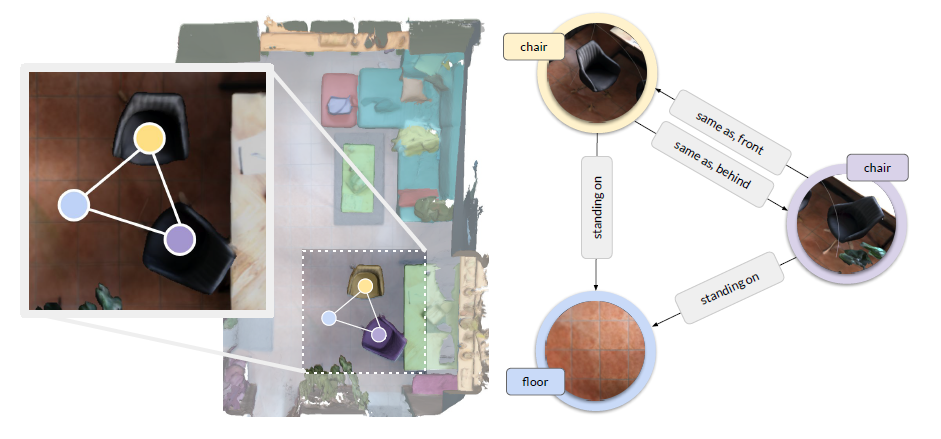

# Discovering Graph Neural Networks for Indoor 3D Scene Representation

Master's Thesis of Fabiola Pasini \
University of Parma  \
Technical University of Munich \
Computer Aided Medical Procedures (CAMP) chair

# Summary
The problem addressed in this thesis is the development of specialized Graph Neural Networks (GNNs) for understanding indoor scenes. The project aimed to generate a scene graph that describes an indoor environment—such as a bedroom or living room—based on a segmented point cloud representing an indoor scene. This thesis focuses specifically on the study and implementation of GNNs.

Graph Neural Networks have become a prominent field of research in recent years, with various variants of the original GNN architecture being proposed. Most well-known studies have primarily focused on nodes and their features, often overlooking the edges between them.

Scene graphs, a particular type of graph, represent objects in a scene as nodes and the relationships between them as edges. These graphs play a crucial role in both scene understanding and representation. The purpose of my thesis was to implement a GNN architecture capable of learning not only node features but also edge features, allowing for the prediction of graphs that fully describe a scene by incorporating the relationships between objects.

    

# Programming language and main libraries used:
Python\
OpenCV \
PyTorch \
Pytorch Geometric \
Trimesh 

# Work done
In this thesis, I began by using the code from this [repository](https://github.com/ShunChengWu/3DSSG), focusing primarily on Graph Neural Networks (GNNs). I first explored the concepts and principles behind the original GNN model, followed by an in-depth study of five state-of-the-art GNN architectures. Finally, I replaced the original network with these five different architectures and compared their performance.

## Nets
1. GCN,
2. GRAPH ISOMORPHISM NETWORK
3. GraphSAGE,
4. Updated GraphEdgeAttenNetworkLayers with PyTorch Geometric,
5. Updated GraphEdgeAttenNetworkLayers with some part of Graphormer Net.

# References

### References

1. Wald, J., Dhamo, H., Navab, N., & Tombari, F. (2020). Learning 3D Semantic Scene Graphs from 3D Indoor Reconstructions. In *Proceedings of the IEEE Conference on Computer Vision and Pattern Recognition (CVPR)*.

2. Johnson, J., Gupta, A., & Fei-Fei, L. (2018). Image Generation from Scene Graphs. In *Proceedings of the IEEE Conference on Computer Vision and Pattern Recognition (CVPR)*.

3. Wald, J., Avetisyan, A., Navab, N., Tombari, F., & Niessner, M. (2019). RIO: 3D Object Instance Re-Localization in Changing Indoor Environments. In *Proceedings of the IEEE International Conference on Computer Vision (ICCV)*.

4. Kipf, T. N., & Welling, M. (2016). Semi-Supervised Classification with Graph Convolutional Networks. *arXiv preprint arXiv:1609.02907*.

5. Vaswani, A., Shazeer, N., Parmar, N., Uszkoreit, J., Jones, L., Gomez, A. N., Kaiser, Ł., & Polosukhin, I. (2017). Attention is All You Need. In *Advances in Neural Information Processing Systems*.

6. Wu, S.-C., Wald, J., Tateno, K., Navab, N., & Tombari, F. (2021). SceneGraphFusion: Incremental 3D Scene Graph Prediction from RGB-D Sequences. In *Proceedings of the IEEE Conference on Computer Vision and Pattern Recognition (CVPR)*.

7. Hamilton, W. L., Ying, R., & Leskovec, J. (2017). Inductive Representation Learning on Large Graphs. In *Advances in Neural Information Processing Systems (NIPS)*.

8. Xu, K., Hu, W., Leskovec, J., & Jegelka, S. (2019). How Powerful are Graph Neural Networks? *arXiv preprint arXiv:1810.00826*.

9. Fey, M., & Lenssen, J. E. (2019). Fast Graph Representation Learning with PyTorch Geometric. In *ICLR Workshop on Representation Learning on Graphs and Manifolds*.

